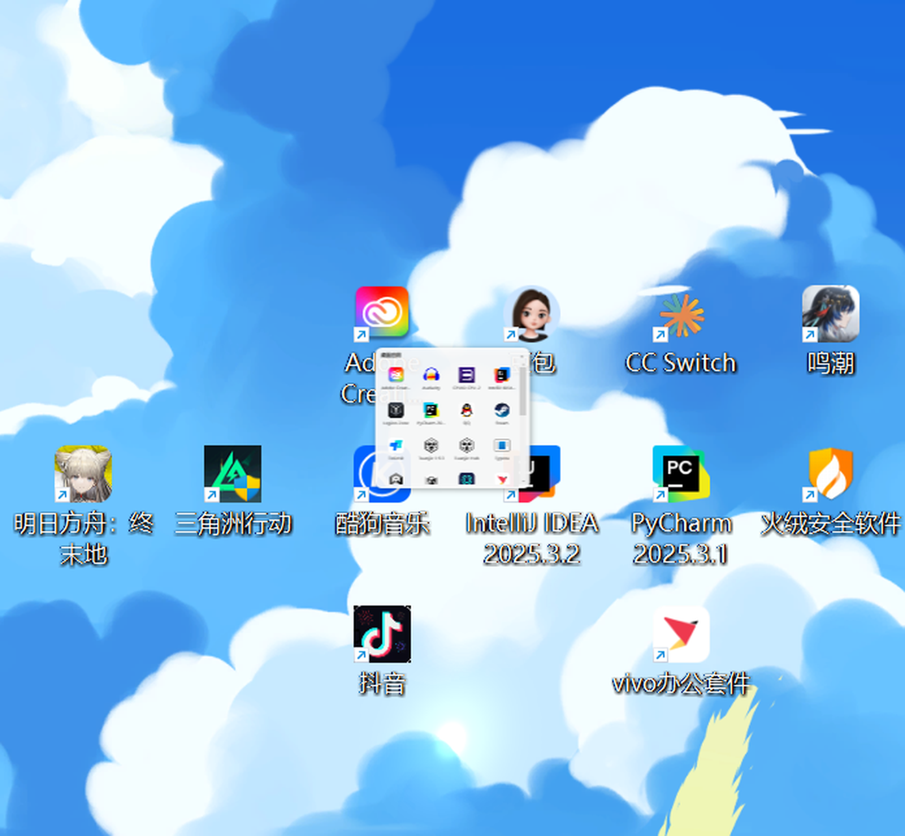
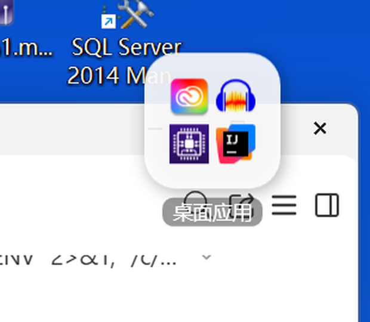

# DeskFolder — 安卓风格的 Windows 桌面快捷方式文件夹

> 把桌面快捷方式按文件夹整理，像手机 App 文件夹一样悬停展开、动画流畅、轻量无感。


*展开态：鼠标悬停自动展开，图标网格排列，支持滚动*


*折叠态：吸附桌面图标网格，可自由拖动*

## ✨ 功能特性

- **安卓风格文件夹** — 桌面上显示为小图标（折叠态），鼠标悬停自动展开为图标网格（展开态），移走后平滑收起
- **流畅动画** — 基于 `CompositionTarget.Rendering` 帧驱动的 EaseOutCubic 缓动，窗口尺寸仅在展开起点/终点一次性变化，消除透明分层窗口的残影与抖动
- **拖动换位** — 折叠态支持拖动到桌面任意位置，自动吸附桌面图标网格
- **拖放添加** — 直接把桌面 `.lnk` 快捷方式拖进文件夹即可添加
- **主题系统**：
  - 🎨 纯色主题（圆角 + 毛玻璃/透明度可选）
  - 🖼️ 图片背景主题（单图/多图模式，支持轮播/随机播放，切换间隔 1~60 分钟）
  - ✂️ 图片裁剪（折叠态和展开态独立裁剪，归一化坐标精确控制）
  - GIF 动图逐帧播放
- **自定义行列数** — 每个文件夹独立设置网格行列
- **托盘常驻** — 右下角托盘图标，右键菜单：全局主题设置 / 重新排列 / 新建空白文件夹 / 开机自启动 / 退出
- **开机自启动** — 可选，写入注册表 `Run` 项
- **配置持久化** — `%APPDATA%\DeskFolder\settings.json`
- **轻量** — framework-dependent 发布仅 ~192KB（需 .NET 8 桌面运行时）

## 🔧 技术栈

| 组件 | 技术 |
|------|------|
| UI 框架 | WPF (.NET 8, `net8.0-windows`) |
| 窗口模型 | 透明无边框置顶 (`WindowStyle=None`, `AllowsTransparency=True`) |
| 动画引擎 | `CompositionTarget.Rendering` 帧驱动 + EaseOutCubic |
| 图标提取 | Win32 `SHGetFileInfo` / `IExtractIcon` |
| 托盘图标 | Win32 `Shell_NotifyIcon` (原生 API) |
| 配置存储 | System.Text.Json → `%APPDATA%/DeskFolder/settings.json` |
| 构建工具 | .NET SDK 8+ |

## 📦 构建与运行

### 前置条件

- [.NET 8 桌面运行时](https://dotnet.microsoft.com/download/dotnet/8.0)（或 .NET SDK 用于自行构建）

### 构建

```bash
# 开发环境构建（Release）
bash build.sh

# 或手动构建
dotnet build -c Release
```

### 发布（framework-dependent）

```bash
env -i PATH="/c/Program Files/dotnet:..." dotnet publish -c Release -o out_release
```

> ⚠️ 在沙箱环境中构建时需用 `env -i` 补齐环境变量（详见 `build.sh`）。

### 运行

直接双击发布目录中的 `DeskFolder.exe`。首次启动会自动导入当前桌面的全部 `.lnk` 快捷方式。

## 📁 项目结构

```
DeskFolder/
├── App.xaml / App.xaml.cs          # 应用入口、全局异常兜底、托盘初始化
├── DeskFolder.csproj               # 项目文件 (net8.0-windows, WPF)
├── TrayIcon.cs                     # Win32 托盘图标（原生 Shell_NotifyIcon）
├── app.manifest                    # UAC 清单
├── build.sh                        # 构建脚本（沙箱兼容）
│
├── Models/
│   └── ShortcutItem.cs             # 快捷方式数据模型
│
├── Services/
│   ├── SettingsService.cs          # 配置加载/保存（含图片主题数据模型）
│   ├── ShortcutService.cs          # .lnk 解析 + 图标提取
│   ├── StartupService.cs           # 注册表开机自启动管理
│   └── ThemeHelper.cs              # 颜色转换（RGB↔HSV）+ 色值解析
│
├── Views/
│   ├── FolderWindow.xaml/.cs       # 核心窗口：折叠/展开/动画/拖动/渲染
│   ├── SettingsWindow.xaml/.cs     # 全局设置：文件夹管理 + 主题选择
│   ├── ThemeEditorWindow.xaml/.cs  # 主题编辑器：颜色/图片/轮播/裁剪
│   ├── ImageCropWindow.xaml/.cs    # 图片裁剪对话框（折叠/展开独立编辑）
│   ├── ManageIconsWindow.xaml/.cs  # 文件夹内图标管理（增删排序）
│   ├── RenameWindow.xaml/.cs       # 重命名对话框
│   ├── ExpandArrangeWindow.xaml/.cs # 展开态排列预览
│   └── FoldArrangeWindow.xaml/.cs  # 折叠态排列预览
│
├── docs/
│   ├── screenshot.png              # 主截图
│   └── screenshot-collapsed.png    # 折叠态特写
│
├── LICENSE                         # MIT 协议
└── README.md                       # 本文件
```

## ⚙️ 配置说明

配置文件位于 `%APPDATA%\DeskFolder\settings.json`，主要字段：

```json
{
  "Folders": [ { "Name": "...", "X": 0, "Y": 0, ... } ],
  "Shortcuts": [ { "FolderId": "...", "Path": "C:\\...\\xxx.lnk", ... } ],
  "Rows": 3,
  "Columns": 4,
  "Themes": [
    {
      "Type": "Image",
      "ImageLayout": "Single",     // Single | Multi
      "Single": { "Paths": [...], "Play": "Sequential", "IntervalMinutes": 5 },
      "Collapsed": { ... },        // Multi 模式下折叠态独立配置
      "Expanded": { ... },         // Multi 模式下展开态独立配置
      ...
    }
  ]
}
```

## 🐛 已知问题 & 排查

- 若遇到异常闪退，程序会弹出错误框并将完整堆栈写入 `%APPDATA%\DeskFolder\crash.log`，将日志内容反馈给维护者即可快速定位。
- WPF 透明置顶窗口在部分远程桌面/VirtualBox 环境下可能表现异常，建议在物理显示器上使用。

## 📄 License

[MIT](LICENSE) © 2026 唐朋成
